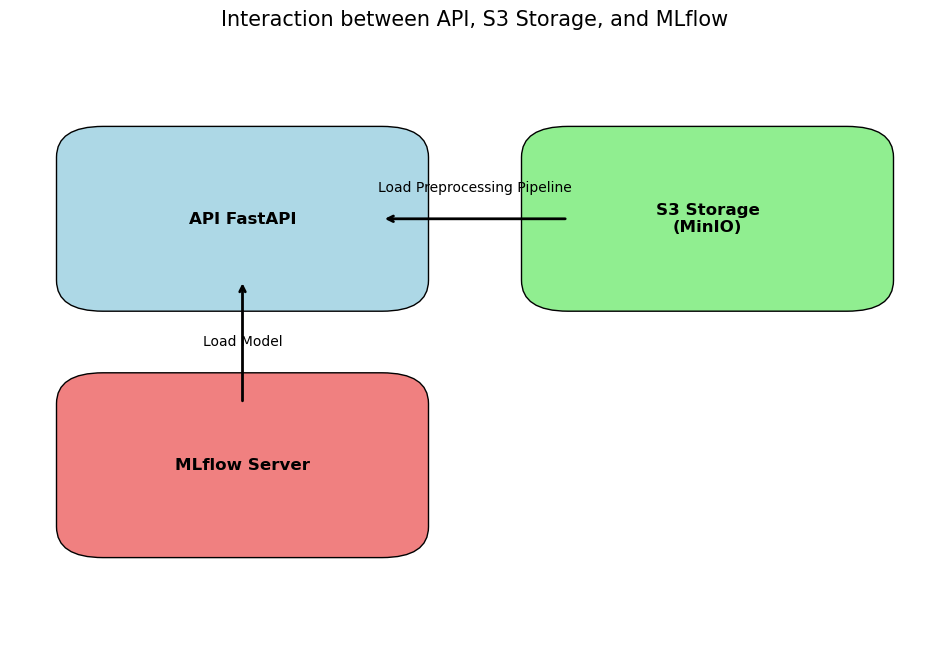
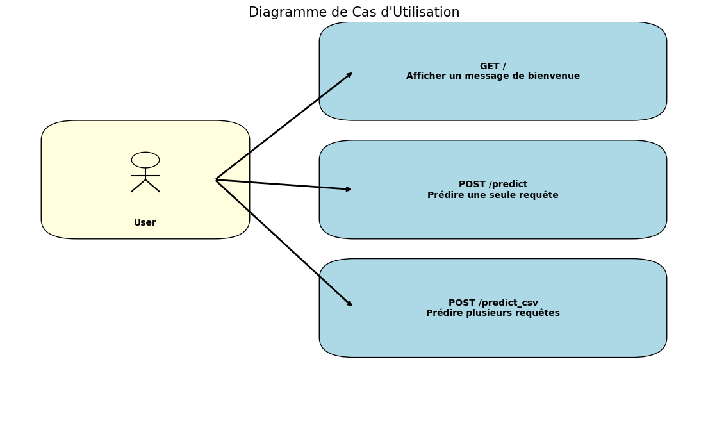

# ML-SOC-API

## Description
This project provides an API for classifying requests using a pre-trained Random Forest model and a preprocessing pipeline.

## Interactions de l'API

Le schéma suivant illustre les interactions entre l'API, le stockage S3 et le serveur MLflow lors du processus de prédiction :



1. **API FastAPI** :
   - Gère les requêtes des utilisateurs pour les prédictions.
   - Charge le pipeline de prétraitement depuis S3 (MinIO).
   - Charge le modèle de classification depuis MLflow.

2. **Stockage S3 (MinIO)** :
   - Stocke le pipeline de prétraitement utilisé par l'API.

3. **Serveur MLflow** :
   - Fournit le modèle de classification pré-entraîné utilisé par l'API.

### Interactions

- **Charger le pipeline de prétraitement** : L'API FastAPI télécharge le pipeline de prétraitement depuis le stockage S3.
- **Charger le modèle** : L'API FastAPI charge le modèle de classification depuis le serveur MLflow.

### Endpoints de l'API

1. **GET /** :
   - **Description** : Retourne un message de bienvenue avec les détails du modèle.
   - **Exemple de réponse** :
     ```json
     {
       "message": "Hello from Request classifier 2",
       "model_name": "random_forest_detection",
       "model_version": "6"
     }
     ```

2. **POST /predict** :
   - **Description** : Prédit la classification d'une requête unique.
   - **Paramètres** :
     ```json
     {
       "Method": "GET",
       "User_Agent": "Mozilla/5.0",
       "Pragma": "no-cache",
       "Cache_Control": "no-cache",
       "Accept": "text/html",
       "Accept_encoding": "gzip, deflate",
       "Accept_charset": "UTF-8",
       "language": "en-US",
       "host": "example.com",
       "cookie": "example_cookie",
       "content_type": "application/json",
       "connection": "keep-alive",
       "lenght": "0",
       "content": "",
       "URL": "/index.html HTTP/1.1"
     }
     ```
   - **Exemple de réponse** :
     ```json
     {
       "url": "/index.html",
       "prediction": 0
     }
     ```

3. **POST /predict_csv** :
   - **Description** : Prédit la classification pour plusieurs requêtes à partir d'un fichier CSV.
   - **Paramètres** : Un fichier CSV contenant les colonnes suivantes : `Method`, `User-Agent`, `Pragma`, `Cache-Control`, `Accept`, `Accept-encoding`, `Accept-charset`, `language`, `host`, `cookie`, `content-type`, `connection`, `lenght`, `content`, `URL`.
   - **Exemple de réponse** :
     ```json
     {
       "predictions": [
         {"url": "/index.html", "prediction": 0},
         {"url": "/about.html", "prediction": 1}
       ]
     }
     ```

### Schéma des Endpoints

Le schéma suivant illustre les interactions des endpoints de l'API :


