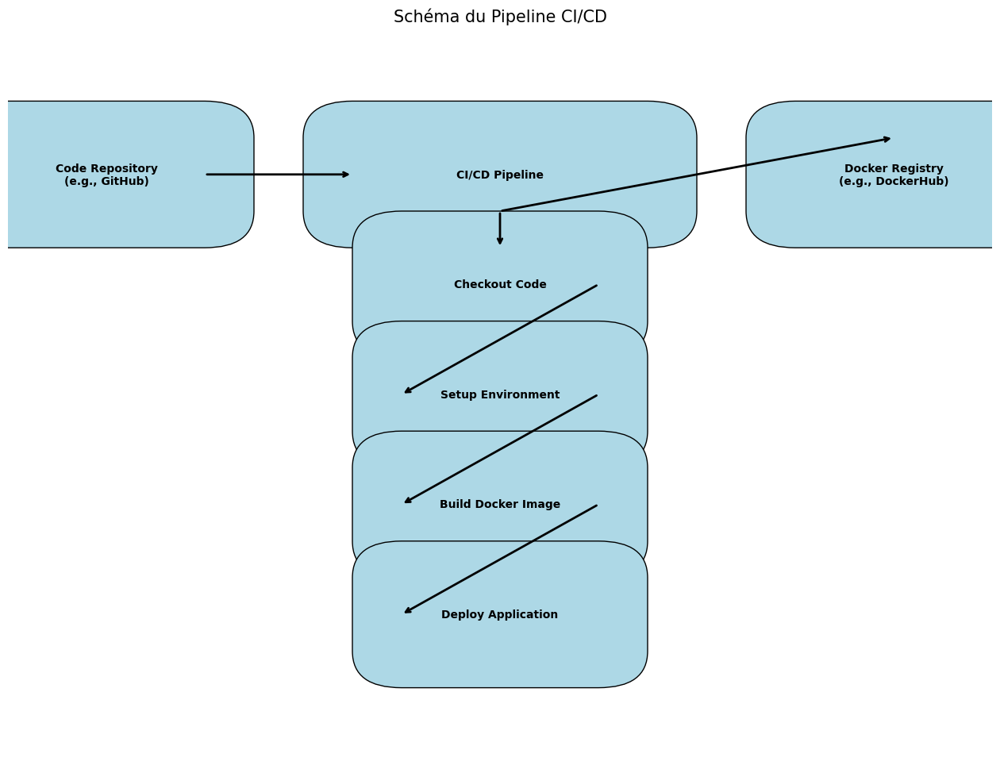

# ML-SOC-API

## Description
Ce projet fournit une API pour classer les requêtes en utilisant un modèle Random Forest pré-entraîné et un pipeline de prétraitement.

## Endpoints de l'API

### Diagramme des Endpoints

Le schéma suivant illustre les interactions des endpoints de l'API :


1. **GET /** :
   - **Description** : Retourne un message de bienvenue avec les détails du modèle.
   - **Exemple de réponse** :
     ```json
     {
       "message": "Hello from Request classifier 2",
       "model_name": "random_forest_detection",
       "model_version": "6"
     }
     ```

2. **POST /predict** :
   - **Description** : Prédit la classification d'une requête unique.
   - **Paramètres** :
     ```json
     {
       "Method": "GET",
       "User_Agent": "Mozilla/5.0",
       "Pragma": "no-cache",
       "Cache_Control": "no-cache",
       "Accept": "text/html",
       "Accept_encoding": "gzip, deflate",
       "Accept_charset": "UTF-8",
       "language": "en-US",
       "host": "example.com",
       "cookie": "example_cookie",
       "content_type": "application/json",
       "connection": "keep-alive",
       "lenght": "0",
       "content": "",
       "URL": "/index.html HTTP/1.1"
     }
     ```
   - **Exemple de réponse** :
     ```json
     {
       "url": "/index.html",
       "prediction": 0
     }
     ```

3. **POST /predict_csv** :
   - **Description** : Prédit la classification pour plusieurs requêtes à partir d'un fichier CSV.
   - **Paramètres** : Un fichier CSV contenant les colonnes suivantes : `Method`, `User-Agent`, `Pragma`, `Cache-Control`, `Accept`, `Accept-encoding`, `Accept-charset`, `language`, `host`, `cookie`, `content-type`, `connection`, `lenght`, `content`, `URL`.
   - **Exemple de réponse** :
     ```json
     {
       "predictions": [
         {"url": "/index.html", "prediction": 0},
         {"url": "/about.html", "prediction": 1}
       ]
     }
     ```


## Interactions de l'API

Le schéma suivant illustre les interactions entre l'API, le stockage S3 et le serveur MLflow lors du processus de prédiction :


1. **API FastAPI** :
   - Gère les requêtes des utilisateurs pour les prédictions.
   - Charge le pipeline de prétraitement depuis S3 (MinIO).
   - Charge le modèle de classification depuis MLflow.

2. **Stockage S3 (MinIO)** :
   - Stocke le pipeline de prétraitement utilisé par l'API.

3. **Serveur MLflow** :
   - Fournit le modèle de classification pré-entraîné utilisé par l'API.

### Interactions

- **Charger le pipeline de prétraitement** : L'API FastAPI télécharge le pipeline de prétraitement depuis le stockage S3.
- **Charger le modèle** : L'API FastAPI charge le modèle de classification depuis le serveur MLflow.

## Processus de Construction et de Déploiement Docker

Ce projet utilise GitHub Actions pour automatiser la construction et le déploiement d'une image Docker sur DockerHub.

### Schéma du Processus

Le schéma suivant illustre les étapes du processus :



1. **Code Repository** :
   - Le code source est hébergé dans un dépôt GitHub.
   
2. **CI/CD Pipeline** :
   - GitHub Actions est utilisé pour automatiser le processus de construction et de déploiement.
   
3. **QEMU Setup** :
   - Configuration de QEMU pour l'émulation multi-architecture.

4. **Buildx Setup** :
   - Configuration de Docker Buildx pour la construction multi-architecture.
   
5. **Docker Build & Push** :
   - Construction de l'image Docker et déploiement sur DockerHub.

6. **DockerHub** :
   - L'image Docker est stockée et disponible sur DockerHub.

### Configuration de GitHub Actions

Le fichier YAML suivant configure le workflow GitHub Actions pour automatiser ce processus :

```yaml
name: Build and Deploy Docker Image

on:
  push:
    branches:
      - main
      - dev
    tags:
      - 'v*.*.*'

jobs:
  build-and-deploy:
    runs-on: ubuntu-latest

    steps:
      - name: Checkout code
        uses: actions/checkout@v4

      - name: Set up QEMU
        uses: docker/setup-qemu-action@v3

      - name: Set up Docker Buildx
        uses: docker/setup-buildx-action@v3

      - name: Login to DockerHub
        uses: docker/login-action@v3
        with:
          username: ${{ secrets.DOCKERHUB_USERNAME }}
          password: ${{ secrets.DOCKERHUB_TOKEN }}

      - name: Build and push Docker image
        uses: docker/build-push-action@v5
        with:
          context: .
          push: true
          tags: ${{ secrets.DOCKERHUB_USERNAME }}/my-app:latest